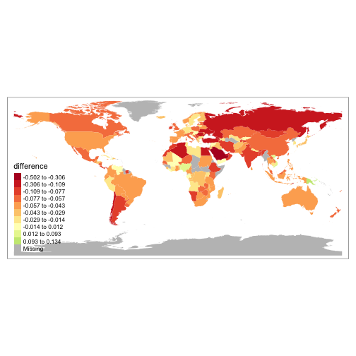
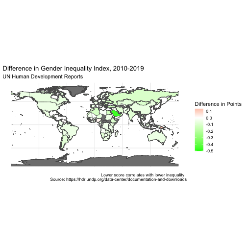

``` r
library(countrycode)
library(usethis)
library(rmarkdown)
library(knitr)
library(tinytex)
library(here)
library(tidyverse)
library(broom)
library(sf)
library(fs)
library(janitor)
library(tmap)
library(tmaptools)
library(ggplot2)
library(dplyr)
```


``` r
#read in world countries simple features
world_countries <- read_sf(here("World_Countries_(Generalized)_9029012925078512962.geojson"))

# read in inequality data
inequality <- read_csv(here("HDR23-24_Composite_indices_complete_time_series.csv"))
```

```
## Rows: 206 Columns: 1076
## ── Column specification ──────────────────────────────────────────────────────────────────────────────────────────────
## Delimiter: ","
## chr    (4): iso3, country, hdicode, region
## dbl (1072): hdi_rank_2022, hdi_1990, hdi_1991, hdi_1992, hdi_1993, hdi_1994, hdi_1995, hdi_1996, hdi_1997, hdi_199...
## 
## ℹ Use `spec()` to retrieve the full column specification for this data.
## ℹ Specify the column types or set `show_col_types = FALSE` to quiet this message.
```

``` r
# create data frame of just what we need
inequality_2010_2019 <- select(inequality, country, iso3, gii_2019, gii_2010)

# create column for difference in gii
inequality_2010_2019 <- inequality_2010_2019 %>%
  clean_names(.,) %>%
  rename(., iso = iso3) %>%
  select(iso, gii_2019, gii_2010) %>%
  mutate(., difference = gii_2019 - gii_2010)

# clean names world_countries
world_countries <- clean_names(world_countries)

# change country code in world countries to iso3
world_countries$iso <- countrycode(world_countries$iso, "iso2c", "iso3c")

# join data
world_countries_difference_gii <- left_join(world_countries, inequality_2010_2019, by="iso")

# plot data
qtm(world_countries_difference_gii,
    fill="difference",
    fill.n=10,
    fill.style="kmeans",
    midpoint= 0,
    borders = NULL)
```

```
## Variable(s) "difference" contains positive and negative values, so midpoint is set to 0. Set midpoint = NA to show the full spectrum of the color palette.
```



``` r
ggplot(world_countries_difference_gii, aes(fill = difference)) +
  geom_sf() +
  scale_fill_gradient2("Difference in Points",   low = "green",
  mid = "white",
  high = "red",
  midpoint = 0,) +
  theme_minimal() +
  labs(
    title = "Difference in Gender Inequality Index, 2010-2019",
    subtitle = "UN Human Development Reports",
    caption = "Lower score correlates with lower inequality. \nSource: https://hdr.undp.org/data-center/documentation-and-downloads"
  )  
```



These show the change in gender equality by country, as measured by Gender Inequality Index.


``` r
positive_difference <- dplyr::filter(world_countries_difference_gii, difference>0)
positive_difference
```

```
## Simple feature collection with 10 features and 8 fields
## Geometry type: MULTIPOLYGON
## Dimension:     XY
## Bounding box:  xmin: -89.2164 ymin: -11.6425 xmax: 155.9668 ymax: 35.68861
## Geodetic CRS:  WGS 84
## # A tibble: 10 × 9
##      fid country          iso   countryaff              aff_iso                  geometry gii_2019 gii_2010 difference
##  * <int> <chr>            <chr> <chr>                   <chr>          <MULTIPOLYGON [°]>    <dbl>    <dbl>      <dbl>
##  1    23 Belize           BLZ   Belize                  BZ      (((-88.2995 18.48293, -8…    0.46     0.407    0.0530 
##  2    24 Benin            BEN   Benin                   BJ      (((2.732954 7.658209, 2.…    0.652    0.636    0.0160 
##  3    61 Cyprus           CYP   Cyprus                  CY      (((33.27229 34.70955, 33…    0.235    0.191    0.044  
##  4    83 Gabon            GAB   Gabon                   GA      (((11.54429 -2.816564, 1…    0.527    0.52     0.00700
##  5   100 Haiti            HTI   Haiti                   HT      (((-73.11111 19.62694, -…    0.624    0.608    0.0160 
##  6   121 Kuwait           KWT   Kuwait                  KW      (((47.46339 28.98446, 47…    0.225    0.209    0.0160 
##  7   162 Nigeria          NGA   Nigeria                 NG      (((11.79944 7.296664, 11…    0.694    0.67     0.0240 
##  8   174 Papua New Guinea PNG   Papua New Guinea        PG      (((146.3791 -8.584709, 1…    0.816    0.682    0.134  
##  9   246 Venezuela        VEN   Venezuela, Bolivarian … VE      (((-66.31029 10.62602, -…    0.497    0.489    0.00800
## 10   247 Vietnam          VNM   Viet Nam                VN      (((107.079 17.10804, 107…    0.391    0.363    0.0280
```

Only `` 10 `` countries had higher inequality in 2019 than 2010.


``` r
negative_difference <- dplyr::filter(world_countries_difference_gii, difference<=0 & !is.na(difference)) %>%
  arrange(., difference)
top_negative_difference <- head(negative_difference)$country
```

The following countries, in order, had the largest improvements in inequality.
`` Qatar, Saudi Arabia, Bhutan, Turkiye, Ukraine, Chile ``
